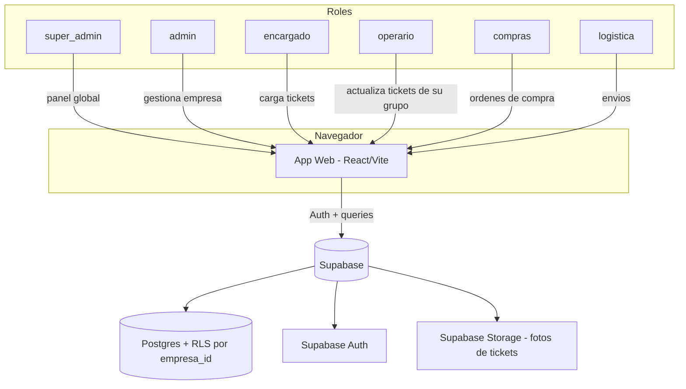

# PRD — Ticketera Multi-Tienda

## 1. Resumen / Propósito

App web multi-empresa (SaaS) para gestión de tickets de mantenimiento e incidencias en redes de tiendas/locales. Reemplaza y mejora la app actual construida en AppSheet ("Mantenimiento"), aportando el nivel de diseño y pulido visual de referencia de Whapicommerce (ver `REFERENCIA-DISEÑO.md` en esta misma carpeta).

Cada empresa cliente (tenant) se registra, carga sus propias tiendas/locales, invita a su equipo, y gestiona sus tickets de principio a fin — desde que se reporta un problema hasta que se resuelve, pasando por la compra de materiales y la logística de traslado si corresponde.

## 2. Roles y permisos

| Rol | Alcance | Qué hace |
|---|---|---|
| **super_admin** | Global, cruza todas las empresas | Panel propio (Nazareno): ve todas las empresas registradas, métricas globales de uso, soporte, alta/baja/suspensión de empresas. No opera tickets del día a día. |
| **admin** | Una empresa (tenant) | Dueño/responsable de la cuenta de la empresa. Da de alta tiendas, invita usuarios y les asigna rol, ve todo dentro de su empresa (tickets, compras, logística), configura la cuenta. Único rol que puede cerrar un ticket definitivamente. |
| **encargado** | Una o varias tiendas de su empresa (vía `usuario_tiendas`) | Reporta tickets (carga incidencias) de la/s tienda/s a su cargo, ve el estado de sus propios tickets. |
| **operario** | Tickets asignados a su grupo/cuadrilla | Ve los tickets asignados a su grupo, los toma, actualiza su estado (en curso → terminado), agrega notas y fotos de avance/resolución. |
| **compras** | Módulo Compras de su empresa | Gestiona órdenes de compra y proveedores vinculados a tickets que requieren materiales; no ve logística ni asigna operarios. |
| **logistica** | Módulo Logística de su empresa | Gestiona envíos/traslados vinculados a tickets que requieren transporte de materiales o personal; no ve compras ni carga tickets. |

**Aislamiento multi-tenant**: cada empresa ve únicamente sus propios datos (tiendas, tickets, usuarios, compras, envíos). El único rol que cruza empresas es `super_admin`.

**Un encargado puede tener varias tiendas** (relación N:N vía `usuario_tiendas`), y solo ve/reporta tickets de las tiendas que tiene asignadas.

**Un operario pertenece a un grupo/cuadrilla** (`grupos`); los tickets se asignan al grupo completo, y cualquier miembro del grupo puede tomarlo y trabajarlo — no se asignan a una persona individual.

### 2.1 Matriz de transición de estados (quién puede mover qué)

| Transición | Quién puede hacerla |
|---|---|
| Nuevo → Asignado | admin (asigna a un grupo/operario) |
| Asignado → En curso | operario del grupo asignado |
| En curso → Terminado | operario del grupo asignado |
| Terminado → Aprobado | admin (o encargado que reportó, a definir en Paso 2) |
| Aprobado → Cerrado | admin únicamente |
| Cualquier estado → Cancelado | admin únicamente |

Un operario nunca puede aprobar ni cerrar su propio ticket — evita que el mismo rol que ejecuta el trabajo certifique que está bien hecho.

## 3. Módulos (cada uno con su propia sección en el menú)

### 3.1 Tickets (núcleo de la app)
- Alta de ticket: tienda, motivo/descripción, **urgencia** (baja/media/alta/emergencia), **tipo de trámite** (incidencia directa/presupuesto/cotización), fecha, fotos.
- Asignación a un grupo/cuadrilla (no a una persona individual).
- Estados: Nuevo → Asignado → En curso → Terminado → Aprobado → Cerrado, más Cancelado como salida lateral desde cualquier estado (ver matriz 2.1).
- Vista lista y vista agrupada por estado con contador (como "Tickets de Grupos" en la referencia).
- Vista detalle maestro-detalle + formulario de alta/edición.
- **Timeline del ticket**: historial cronológico de cambios de estado, comentarios y fotos, con quién y cuándo hizo cada cosa (auditoría).
- **Galería de fotos** del ticket: puede haber varias, subidas en distintos momentos (al reportar, al avanzar, al cerrar) y por distintos roles.
- Marca si un ticket requiere compra de materiales y/o logística de traslado — eso lo hace visible en esos módulos.
- Numeración de ticket correlativa **por empresa** (cada tenant arranca su propia numeración desde 1), no un ID global.

### 3.2 Compras
- Órdenes de compra vinculadas a tickets marcados como "requiere compra".
- Proveedores (alta simple: nombre, contacto).
- Estado de la orden: Pendiente / Comprado / Entregado.
- Un ticket puede generar más de una orden de compra (varios materiales, varios proveedores).

### 3.3 Logística
- Envíos/traslados vinculados a tickets marcados como "requiere logística".
- Datos: origen, destino (tienda), fecha estimada, estado (Pendiente / En tránsito / Entregado).
- Un ticket puede generar más de un envío.

### 3.4 Tiendas
- Grid de tarjetas por tienda (nombre, dirección, teléfono, mini-mapa si tiene geolocalización) — igual al patrón de referencia.
- Alta/edición/baja de tiendas, por empresa.

### 3.5 Usuarios / Equipo
- Alta de usuarios de la empresa, asignación de rol.
- Gestión de **grupos/cuadrillas**: alta de grupo, asignación de operarios a un grupo.
- Gestión de **tiendas por encargado**: asignación N:N de qué tiendas ve/reporta cada encargado.
- **Invitación por email vía Supabase Auth** (`inviteUserByEmail`): el usuario recibe un link, crea su contraseña, y al aceptar se crea su fila en `usuarios` con el `empresa_id` y rol pre-asignados por el admin que invitó. No hay alta de usuarios con contraseña puesta a mano por el admin.

### 3.6 Panel Super Admin (fuera del layout normal de empresa)
- Listado de empresas registradas, fecha de alta, cantidad de tiendas/usuarios, estado (activa/suspendida).
- Métricas globales simples (empresas activas, tickets totales en la plataforma).

## 4. Fuera de alcance del MVP

- Facturación/cobro a las empresas (se agrega después).
- App móvil nativa (queda como web responsive).
- Notificaciones push/WhatsApp automáticas (se evalúa en una v2).
- Reportes avanzados / gráficas de torta tipo "Estado Final" (se agrega en v2, una vez que haya datos reales).

## 5. Modelo de datos

```
empresas (tenants)
  id, nombre, estado (activa/suspendida), creado_en

usuarios
  id, empresa_id (FK, null para super_admin), nombre, email, rol (super_admin/admin/encargado/operario/compras/logistica),
  grupo_id (FK a grupos, solo operarios, nullable), telefono, avatar_url, creado_en

grupos (cuadrillas)
  id, empresa_id (FK), nombre, creado_en

usuario_tiendas (N:N encargado <-> tiendas)
  usuario_id (FK), tienda_id (FK)

tiendas
  id, empresa_id (FK), nombre, direccion, telefono, lat, lng

tickets
  id, empresa_id (FK), tienda_id (FK), numero_ticket (correlativo por empresa),
  fecha_ct, motivo, urgencia (baja/media/alta/emergencia), tipo_tramite (incidencia/presupuesto/cotizacion),
  estado (nuevo/asignado/en_curso/terminado/aprobado/cerrado/cancelado),
  requiere_compra (bool), requiere_logistica (bool),
  grupo_asignado_id (FK a grupos, nullable), cargado_por (usuario_id FK),
  creado_en

ticket_fotos
  id, ticket_id (FK), url, subido_por (usuario_id FK), creado_en

ticket_eventos (timeline / auditoría)
  id, ticket_id (FK), usuario_id (FK), tipo_evento (cambio_estado/comentario/foto_agregada),
  estado_anterior (nullable), estado_nuevo (nullable), comentario (nullable), creado_en

ordenes_compra
  id, empresa_id (FK), ticket_id (FK), proveedor_id (FK), estado (pendiente/comprado/entregado), creado_en

proveedores
  id, empresa_id (FK), nombre, contacto

envios
  id, empresa_id (FK), ticket_id (FK), origen, destino_tienda_id (FK), estado (pendiente/en_transito/entregado), fecha_estimada
```

Todas las tablas con `empresa_id` llevan Row Level Security (RLS) por tenant — cada empresa solo accede a sus propias filas. `super_admin` tiene acceso de bypass sobre `empresas` y lectura agregada. La numeración correlativa de `numero_ticket` se implementa con una secuencia o función por `empresa_id` (no un `serial` global), para que cada empresa vea su propio "Ticket #0001, #0002...".

## 6. Arquitectura (diagrama)



## 7. Stack técnico sugerido (a confirmar en Paso 3)

- **Frontend**: React + Vite + TypeScript + Tailwind (para poder replicar rápido los patrones visuales de la referencia: sidebar, tabs, badges, estados vacíos, etc.)
- **Backend/DB**: Supabase (Postgres + Auth + Storage + RLS) — ya hay MCP de Supabase conectado en este entorno, lo que facilita crear el proyecto y las migraciones directamente.
- **Hosting**: Vercel (también hay MCP conectado).

## 8. Historias de usuario clave (MVP)

1. Como **encargado**, quiero cargar un ticket con foto y descripción para reportar un problema en una de mis tiendas asignadas.
2. Como **admin**, quiero asignar ese ticket a un grupo/cuadrilla para que lo resuelva.
3. Como **operario**, quiero ver solo los tickets asignados a mi grupo, tomarlos y marcarlos como en curso/terminados, agregando fotos y notas.
4. Como **admin**, quiero marcar un ticket como "requiere compra" para que aparezca en el módulo de Compras.
5. Como **compras**, quiero ver los tickets que necesitan materiales y crear una o más órdenes de compra.
6. Como **admin**, quiero marcar un ticket como "requiere logística" para que aparezca en el módulo de Logística.
7. Como **logistica**, quiero ver los envíos pendientes y actualizarlos a "en tránsito"/"entregado".
8. Como **admin**, quiero aprobar y cerrar un ticket terminado, y que un operario no pueda cerrarlo por su cuenta.
9. Como cualquier rol con acceso a un ticket, quiero ver su timeline completo (quién hizo qué y cuándo) para auditar el caso.
10. Como **admin**, quiero invitar usuarios por email con un rol y (si corresponde) tiendas/grupo pre-asignados.
11. Como **super_admin**, quiero ver todas las empresas registradas y su actividad general.
12. Como **admin**, quiero que mi empresa no vea datos de otras empresas (aislamiento total).

## 9. Cronograma orientativo

| Día | Tarea |
|---|---|
| 1 | Setup proyecto (Vite + Tailwind), estructura de carpetas, layout base (sidebar + topbar según referencia) |
| 2 | Supabase: schema completo (incluyendo grupos, usuario_tiendas, ticket_fotos, ticket_eventos), RLS, Auth + invitación por email, seed de datos de prueba |
| 3 | Módulo Tickets: lista, detalle con timeline y galería de fotos, alta/edición |
| 4 | Roles y permisos + matriz de transición de estados + asignación a grupos |
| 5 | Módulo Compras + módulo Logística |
| 6 | Módulo Tiendas + Usuarios/Equipo (grupos, usuario_tiendas, invitaciones) |
| 7 | Panel Super Admin + pulido visual final |

---

*Generado en el Paso 1 (PRD) de la metodología de 6 pasos — versión revisada tras devolución (pros/contras/mejoras aplicadas: grupos/cuadrillas, timeline y fotos del ticket, tiendas por encargado, matriz de estados, invitación por email, urgencia/tipo de trámite separados, numeración por empresa). Próximo paso: Documento de Diseño (wireframes y specs de UI concretas basadas en `REFERENCIA-DISEÑO.md`).*
